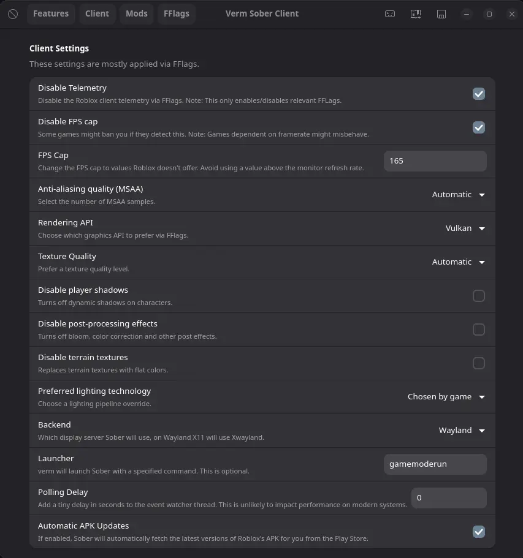

# Notice
As of *8th of May, 2025*: Lucem is now **officially deprecated**. No updates will henceforth be released. 

#

This is why Verm was created.\
Verm is a fork of Lucem, and i am constantly updating it to keep it working.\
I will also be adding new features every now and then.\
Everything in here will stay open-source. \
I did not make the wrapper, i am just maintaining it to the best of my ability

ALL CREDITS GO TO THE OWNER OF THE ORIGINAL REPO: https://github.com/xTrayambak/lucem (Deprecated)

## 
Verm is a small wrapper over [Sober](https://sober.vinegarhq.org) to provide some QoL improvements. \
Please keep in mind that while verm is fully open source software, Sober is proprietary for a very good reason, that being to preserve RoL from 9-year-old skiddies.


# Why choose this fork over the original?
I have adressed and fixed alot of the issues the original has. \
Here are stability, performance, and safety updates:

- Process I/O: stdout/stderr redirection is guarded; on failure we fall back to /dev/null
- Process launch: child inherits no blocking handles (CLOEXEC), dup2 is guarded
- Liveness checks: use `flatpak ps` instead of `pidof` in sandboxed setups
- Bounded exec: all `flatpak` calls run with timeouts and terminate on hang
- Watcher: advances on disconnect, supports polling delay, and avoids busy loops
- Region notifier: triggers on every join; daemon and client fallback paths
- FFlag safety: booleans written as lowercase; only related keys are changed
- Overlay: debug logs throttled; overlay exits cleanly on timer/key
- GUI: save writes immediately and confirms; rendering/texture toggles persist correctly



# Features added
**All Bloxstrap Engine Tweaks** 


## Disclaimer, in big bold letters.
Verm does not allow you to bypass the (reasonable and justified) restrictions the Vinegar team has put on Sober's ability to load APKs that are modified.

If you really cheat on Roblox, I'd say you should reconsider your life decisions than anything. \
**Verm is not associated with the VinegarHQ team or Roblox, nor is it endorsed by them!**
 
## Features
- GTK4 + Libadwaita GUI to modify settings
- GTK4-based FFlag editor that is easy to use
- Rich presence
- Server region notifier
- Game overlay
- If you're not a fan of GUIs, we provide a nifty configuration file that does the same thing! (located at `~/.config/verm/config.toml`, or you can run `verm edit-config`!)
- Managing Sober

Whilst not a feature you use directly, verm also caches API calls whenever it can in order to save bandwidth and resources.

## Icon
The verm icon is made by [AshtakaOOf](https://github.com/AshtakaOOf). It is located [here](src/assets/verm.svg). \
You are free to use it wherever you want.

### Patches
verm provides the following optional patches. All of them go under the `tweaks` section in your configuration.

#### Bring back the old Oof sound
```toml
oldOof = true
```

#### Use another font
Both OTFs and TTFs are supported.
```toml
font = "/path/to/your/font.ttf"
```

#### Replace sun and moon
```toml
sun = "/path/to/sun.jpeg"
moon = "/path/to/moon.jpeg"
```

#### Force X11 or Wayland to be used
This one goes in the `client` section!
```toml
[client]
backend = "x11" # or "wayland", "wl". This is case insensitive.
```

## Installation

### Building from source
You will need the following dependencies to compile verm:

#### Arch
```command
# pacman -S gtk4 libadwaita nim git libcurl
```

#### Fedora
```command
# dnf install gtk4-devel libadwaita-devel git libcurl-devel
```
You can get nim from the [Terra](https://terra.fyralabs.com/) repository

#### Debian
```command
# apt install gtk4 libadwaita-1-0 libadwaita-1-dev git libcurl4-openssl-dev
```
Debian ships an old version of Nim that is not compatible with verm, install Nim [here](https://nim-lang.org/install_unix.html)

#### Ubuntu
```command
sudo apt update
sudo apt install -y libgtk-4-1 libgtk-4-dev libadwaita-1-0 libadwaita-1-dev libcurl4-openssl-dev git build-essential
curl https://nim-lang.org/choosenim/init.sh -sSf | sh
choosenim stable
nim -v
```

#### NixOS
There's no Nix flake yet.
```command
$ git clone https://github.com/vermingov/lucem
$ cd verm
$ nix-shell
```

The package names are similar for other distributions.

#### Dependency Errors
You might encounter Dependency Version errors, this should fix that.
```command
# nimble refresh; rm -rf ~/.nimble/pkgcache ~/.nimble/pkgs2/{owlkettle,nanovg,nimgl,x11,curly,zippy,pretty,semver,jsony,toml_serialization}
# nimble install owlkettle@#3.0.0 toml_serialization@#0.2.14 nimgl@#1.3.2 nanovg@#v0.4.0 x11@#1.2 curly@#1.1.1 zippy@#0.10.16 pretty@#0.2.0 semver@#v1.2.3 jsony@#1.1.5
```

Run the following command to compile verm.
```command
$ nimble install https://github.com/vermingov/lucem
```

## Submitting bug reports
Please make sure to attach the logs that verm generates. Also, please run verm with the verbose flag (`verm run -v`) and submit that log as it contains crucial debugging informationt.

## Usage
### Launching the verm GUI
```command
$ verm shell
```

### Configuring verm
```command
$ verm edit-config
```

This will open the configuration file in your preferred editor. Your configuration will immediately be validated after you exit the editor.

### Launching Roblox
```command
$ verm run
```

### Check build metadata
```command
$ verm meta
```

### Clearing API caches
```command
$ verm clear-cache
```

### Installing Desktop File
```command
$ verm install-desktop-files
```

### Installing Systemd Service (run as user, not root!)
```command
$ verm install-systemd-service
```

## Troubleshooting

### It says `verm: command not found` after compiling!
The nimble binary folder is not in your PATH, you can run:
```command
$ export PATH=$HOME/.nimble/bin:$PATH
```
Add the export to your .bashrc to make it permanent.
